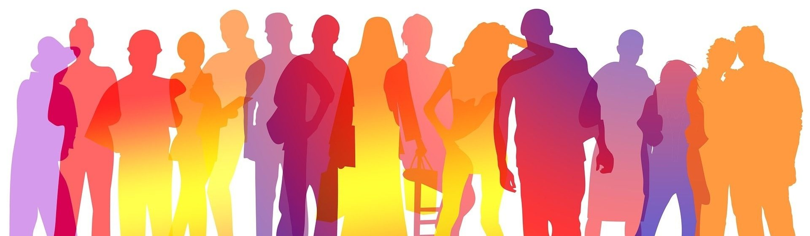

# Diversity & Inclusion Project


## Contents
- [Project Overview](#project-overview)
- [Goals](#goals)
- [User Stories](#user-stories)
- [Wireframe](#wireframe)
- [Project Structure](#project-structure)
- [Pages](#pages)
- [Styles](#styles)
- [Images](#images)
- [Dependencies](#dependencies)
- [Features](#features)
- [AI Usage](#ai-usage)
- [How to Run / Deployment](#how-to-run--deployment)
- [Testing](#testing)
- [Validator Testing](#validator-testing)

## Project Overview
The Diversity & Inclusion Project aims to provide essential information about diversity and inclusion principles and practices. The website helps users understand what diversity and inclusion mean, recognize their importance, and learn how to promote them effectively. The site uses HTML, CSS, and JavaScript with modern accessibility features to create an informative and user-friendly experience.

[Back to Contents](#contents)

## Goals
- **External User's Goal:** To understand diversity and inclusion principles and learn how to recognize and promote them effectively.
- **Site Owner's Goal:** To create an accessible and informative resource that promotes understanding of diversity and inclusion practices.

[Back to Contents](#contents)

## User Stories
1) As a professional working with diverse groups, I want to understand the key principles of diversity and inclusion.
2) As a concerned citizen, I want to learn how to recognize the importance of diversity and inclusion.
3) As a community worker, I want to know the proper steps to promote diversity and inclusion.
4) As an organization leader, I want to understand best practices for implementing diversity and inclusion measures.

[Back to Contents](#contents)

## Wireframe

[Back to Contents](#contents)

## Project Structure
```
diversity-inclusion/
├── assets/
│   ├── css/
│   │   └── styles.css
│   ├── js/
│   │   └── scripts.js
│   ├── images/
│   │   ├── headerim.webp
│   │   └── video-placeholder.jpg
│   └── favicon/
│       └── various favicon files
├── index.html
└── README.md
```
[Back to Contents](#contents)

## Pages
- **index.html:** The main landing page for the Diversity & Inclusion Project website.

[Back to Contents](#contents)

## Styles
- **styles.css:** Contains custom CSS styles for the website.

[Back to Contents](#contents)

## Images
- **images/:** Contains website images including hero and footer backgrounds.

[Back to Contents](#contents)

## Dependencies
None - The project uses vanilla HTML, CSS, and JavaScript.

[Back to Contents](#contents)

## Features
- Responsive design for all device sizes
- Accessibility-focused navigation
- Embedded informational video
- Interactive accordion sections
- ARIA labels for screen readers

[Back to Contents](#contents)

## AI Usage
I used AI to assist in retagging of common code text and for the generation of the images for hero and footer image.

[Back to Contents](#contents)

## How to Run / Deployment
1. Clone the repository:
    ```sh
    git clone https://edite10.github.io/Diveristy-and-Inclusion/
    ```
2. Open `index.html` in your web browser to view the website.

[Back to Contents](#contents)

## Testing
- Responsive design tested across multiple devices
- WCAG 2.1 accessibility compliance
- Color contrast meets accessibility standards
- Screen reader compatibility verified
- Interactive elements keyboard accessible

[Back to Contents](#contents)

## Validator Testing
1. HTML
   - No errors found using W3C validator
2. CSS
   - No errors found using W3C CSS validator
3. Accessibility
   - WAVE WebAIM accessibility evaluation
   - Lighthouse accessibility score: 98

[Back to Contents](#contents)